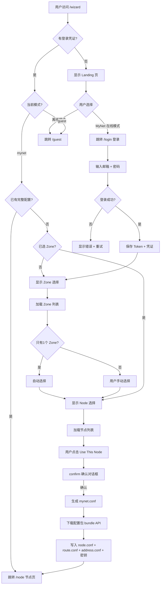
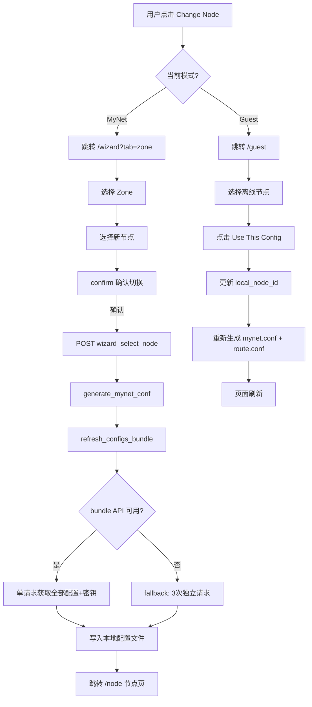
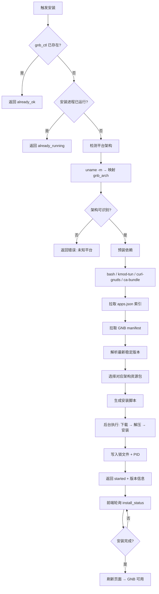
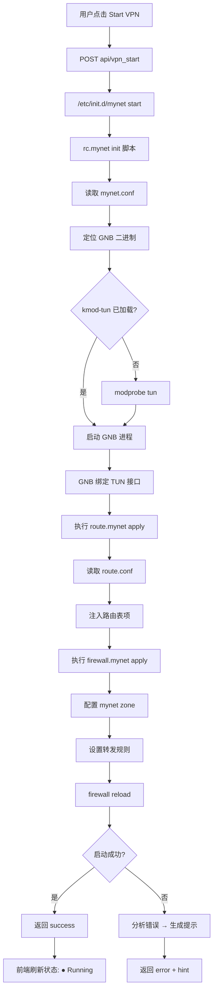
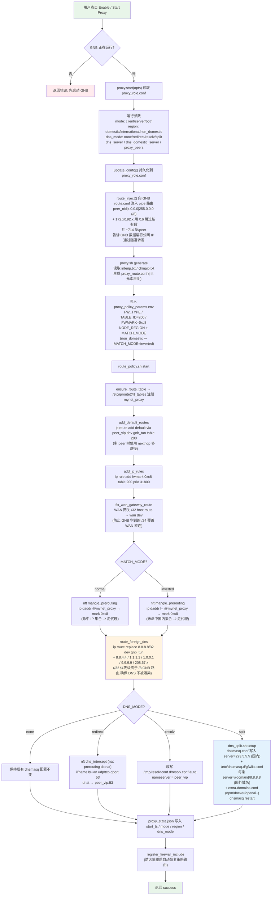
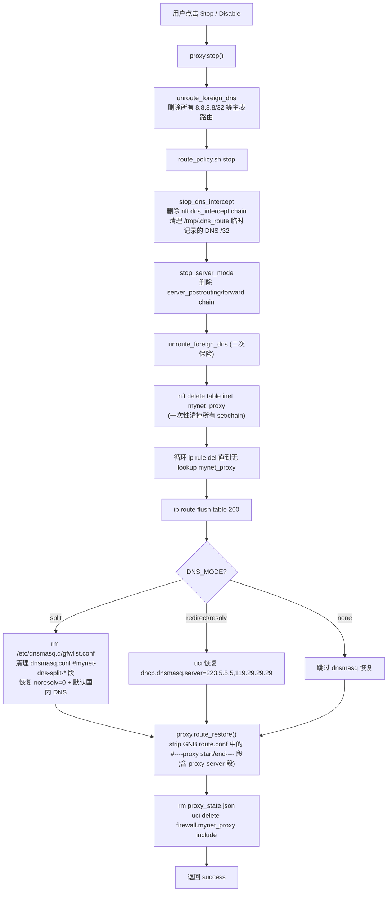
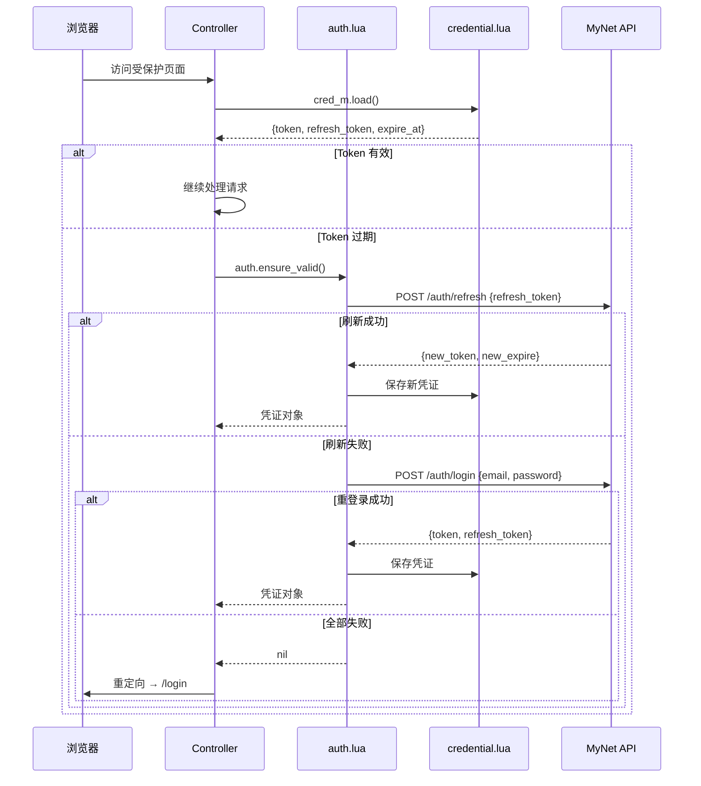
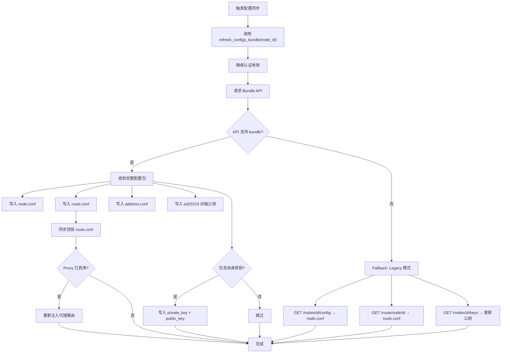

# MyNet LuCI — 核心流程图

> 本文档使用 Mermaid 语法，可在 GitHub 页面直接渲染。

---

## 1. 安装向导流程（Wizard Flow）

首次访问或未配置时，用户通过向导完成初始化。



---

## 2. 节点切换流程（Node Switch Flow）

从节点管理页或向导页切换到不同节点。



---

## 3. GNB 自动安装流程（GNB Auto-Install Flow）

Settings 页面或 Dashboard 检测到 GNB 未安装时触发。



---

## 4. VPN 服务启动流程（Service Start Flow）

用户在 Dashboard 或 Service 页面启动 GNB VPN。



---

## 5. 代理分流运行流程（Proxy Traffic Split Flow）

通过 GNB 隧道进行 nftables + 策略路由分流。代理流量**不走内核主路由表**，而是 fwmark → ip rule → table 200 → gnb_tun；同时**所有已知国外 DNS 服务器（8.8.8.8/1.1.1.1/9.9.9.9 等）通过系统 /32 主路由强制走 gnb_tun**，杜绝 DNS 污染。



### 三种 Region 匹配模式

| Region | IP 集合数据源 | nft 匹配条件 | 适用场景 |
|---|---|---|---|
| `domestic` (默认) | `interip.txt` (国际/海外 IP, ~17000 条) | `ip daddr @set → mark` | 节点在国内,海外流量走 peer |
| `international` | `chinaip.txt` (国内 IP) | `ip daddr @set → mark` | 节点在海外,国内流量走 peer (回国加速) |
| `non_domestic` (新) | `chinaip.txt` (国内 IP) | `ip daddr != @set → mark` | **反向放行**: 集合外的所有流量都走代理,适合"全局代理但国内直连"场景 |

### 四种 DNS 模式

| dns_mode | 工作方式 | LAN 客户端 DNS 路径 | 适用场景 |
|---|---|---|---|
| `none` | 不修改任何 DNS 配置 | 现有 dnsmasq → 现有上游 | 已有自定义 DNS 方案 |
| `redirect` | nft DNAT 拦截 br-lan dport 53 | DNAT → peer_vip:53 (绕过 dnsmasq) | 强制使用 peer 的 smartdns |
| `resolv` | 覆写本机 resolv.conf.auto | LAN 仍走 dnsmasq → peer_vip | 仅修改路由器自身 DNS |
| `split` (新) | dnsmasq 默认走国内 + GFW list 走国外 | dnsmasq 智能分流 (国内 CDN+海外干净 IP) | **推荐**: 无需 peer smartdns 即可分流 |

### 国外 DNS 服务器系统级路由（始终生效）

无论 `dns_mode` 设置如何,代理 `start()` 时都会执行 `route_foreign_dns`:

```text
ip route replace 8.8.8.8/32       dev gnb_tun
ip route replace 8.8.4.4/32       dev gnb_tun
ip route replace 1.1.1.1/32       dev gnb_tun
ip route replace 1.0.0.1/32       dev gnb_tun
ip route replace 9.9.9.9/32       dev gnb_tun
ip route replace 208.67.222.222/32 dev gnb_tun
ip route replace 208.67.220.220/32 dev gnb_tun
```

**作用**: /32 主表路由优先级高于 GNB 注入的 /8,确保任何客户端发往这些公共 DNS 的查询直接通过隧道,**不经过 ISP DNS 拦截/污染**。`stop()` 时通过 `unroute_foreign_dns` 全部撤销。

### DNS 流量路径详细对比

| 流量来源 / dns_mode | none | redirect | resolv | split |
|---|---|---|---|---|
| LAN 客户端 → 53 | dnsmasq → 原上游 | DNAT → peer_vip | dnsmasq → peer_vip | dnsmasq 分流 (国内 223.5.5.5 / 国外 8.8.8.8) |
| 路由器自身 → 53 | dnsmasq → 原上游 | dnsmasq → 原上游 (OUTPUT 不 DNAT) | resolver → peer_vip | dnsmasq 分流 |
| 客户端直连 8.8.8.8 | /32 主表 → gnb_tun | /32 主表 → gnb_tun | /32 主表 → gnb_tun | /32 主表 → gnb_tun |

### 代理停止流程



---

## 6. 页面导航总览（Navigation Map）

```mermaid
flowchart LR
    subgraph 菜单页面
        IDX[Dashboard<br/>/index]
        NODE[Node<br/>/node]
        SVC[Operations<br/>/service]
        PLG[Plugins<br/>/plugin]
        SET[Settings<br/>/settings]
    end

    subgraph 功能页面
        WIZ[Wizard<br/>/wizard]
        LOGIN[Login<br/>/login]
        GUEST[Guest<br/>/guest]
        PROXY[Proxy<br/>/proxy]
    end

    subgraph "兼容重定向 (旧路由)"
        ZONES[/zones] -.-> NODE
        NODES[/nodes] -.-> NODE
        STATUS[/status] -.-> IDX
        DIAG[/diagnose] -.-> SVC
        LOG[/log] -.-> SVC
        NET[/network] -.-> SVC
        GNB_MON[/gnb] -.-> SVC
        NM[/node/manager] -.-> NODE
    end

    IDX --> NODE
    NODE -- "Change Node" --> WIZ
    NODE -- "Change Node (Guest)" --> GUEST
    PLG -- "Configure" --> PROXY
    WIZ -- "Login" --> LOGIN
    WIZ -- "Offline" --> GUEST
    LOGIN -- "成功" --> WIZ
    SET -- "GNB Install" --> IDX
```

---

## 7. 认证流程（Authentication Flow）



---

## 8. 配置同步流程（Config Sync / Bundle API）


