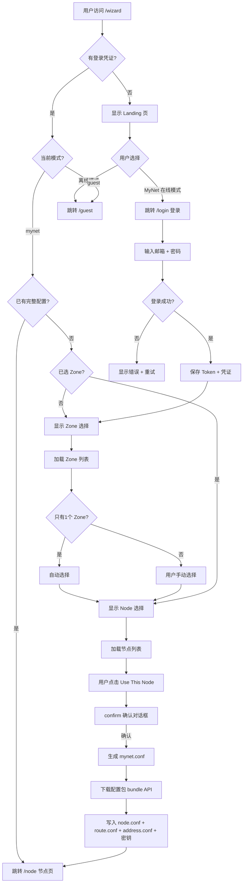
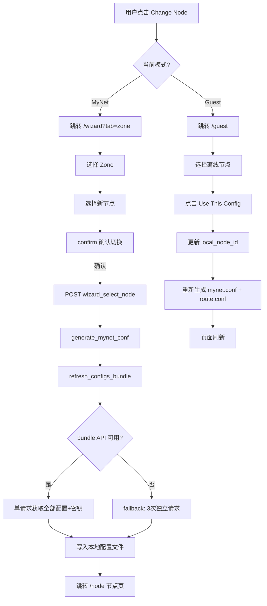
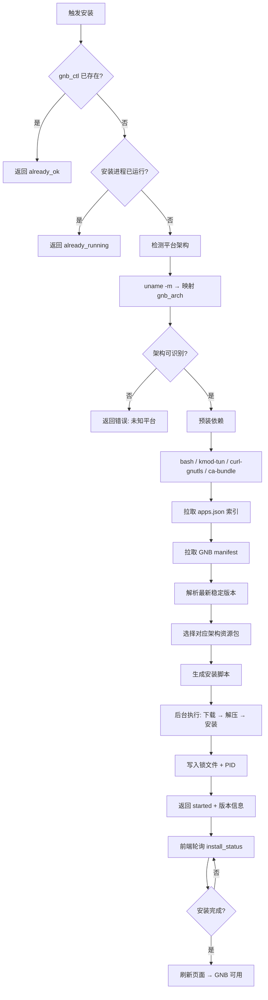
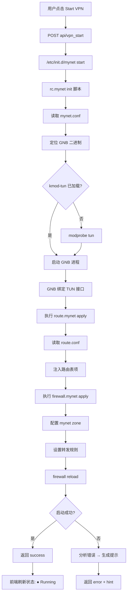
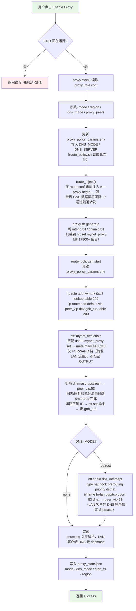
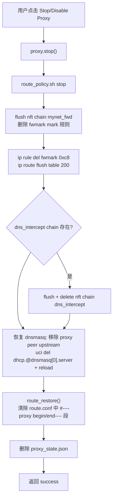
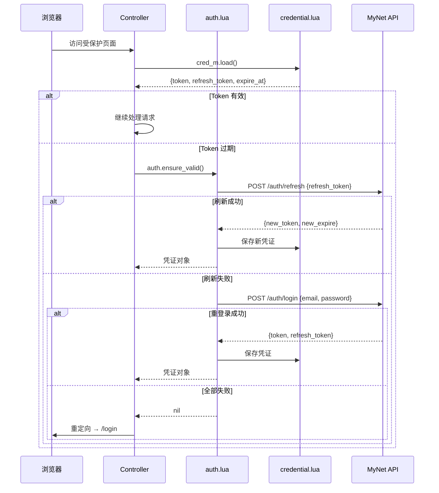
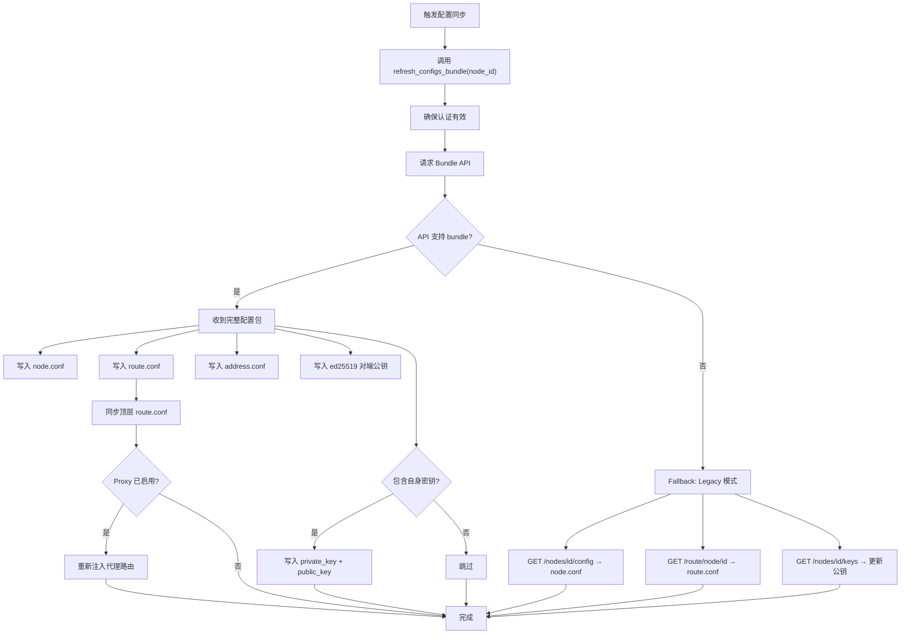

# MyNet LuCI — 核心流程图

> 本文档使用 Mermaid 语法，可在 GitHub 页面直接渲染。

---

## 1. 安装向导流程（Wizard Flow）

首次访问或未配置时，用户通过向导完成初始化。



---

## 2. 节点切换流程（Node Switch Flow）

从节点管理页或向导页切换到不同节点。



---

## 3. GNB 自动安装流程（GNB Auto-Install Flow）

Settings 页面或 Dashboard 检测到 GNB 未安装时触发。



---

## 4. VPN 服务启动流程（Service Start Flow）

用户在 Dashboard 或 Service 页面启动 GNB VPN。



---

## 5. 代理分流运行流程（Proxy Traffic Split Flow）

通过 GNB 隧道进行 nftables + 策略路由分流。代理流量**不走内核主路由表**，走 fwmark → ip rule → table 200 → gnb_tun。



### DNS 流量路径说明

| 流量来源 | dns_mode=none | dns_mode=redirect |
|---|---|---|
| LAN 客户端 DNS | → dnsmasq → peer_vip:53 | DNAT 直接 → peer_vip:53（绕过 dnsmasq） |
| 路由器自身 DNS | → dnsmasq → peer_vip:53 | → dnsmasq → peer_vip:53（OUTPUT 不被 DNAT） |
| peer_vip:53 到 9.1 | 直连路由 10.133.245.0/24 dev gnb_tun | 同左（不经过 fwmark 策略路由） |

### 代理停止流程



---

## 6. 页面导航总览（Navigation Map）

```mermaid
flowchart LR
    subgraph 菜单页面
        IDX[Dashboard<br/>/index]
        NODE[Node<br/>/node]
        SVC[Operations<br/>/service]
        PLG[Plugins<br/>/plugin]
        SET[Settings<br/>/settings]
    end

    subgraph 功能页面
        WIZ[Wizard<br/>/wizard]
        LOGIN[Login<br/>/login]
        GUEST[Guest<br/>/guest]
        PROXY[Proxy<br/>/proxy]
    end

    subgraph "兼容重定向 (旧路由)"
        ZONES[/zones] -.-> NODE
        NODES[/nodes] -.-> NODE
        STATUS[/status] -.-> IDX
        DIAG[/diagnose] -.-> SVC
        LOG[/log] -.-> SVC
        NET[/network] -.-> SVC
        GNB_MON[/gnb] -.-> SVC
        NM[/node/manager] -.-> NODE
    end

    IDX --> NODE
    NODE -- "Change Node" --> WIZ
    NODE -- "Change Node (Guest)" --> GUEST
    PLG -- "Configure" --> PROXY
    WIZ -- "Login" --> LOGIN
    WIZ -- "Offline" --> GUEST
    LOGIN -- "成功" --> WIZ
    SET -- "GNB Install" --> IDX
```

---

## 7. 认证流程（Authentication Flow）



---

## 8. 配置同步流程（Config Sync / Bundle API）


